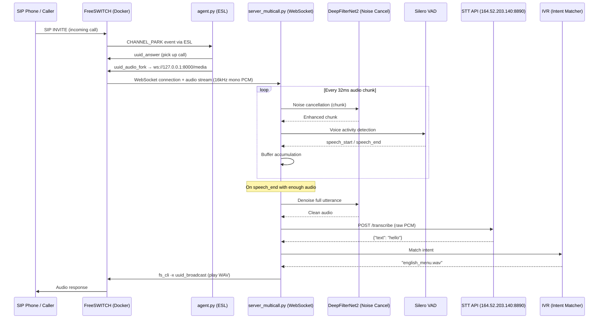

# FreeSWITCH VoiceBot — Full Code Audit & Runbook

## How It Works (Architecture)



### Component Roles

| Component | File(s) | Role |
|---|---|---|
| **FreeSWITCH** | Docker image `rajunify123/freeswitch-mod-audio-fork` | SIP telephony engine + `mod_audio_fork` for WebSocket audio streaming |
| **ESL Agent** | [agent.py](file:///c:/Users/unify/freeswitch_voicebot/agent.py) | Listens for incoming calls via ESL, answers them, forks audio to WebSocket |
| **WebSocket Server** | [server_multicall.py](file:///c:/Users/unify/freeswitch_voicebot/server_multicall.py) | Receives audio stream, runs the processing pipeline, manages sessions |
| **Noise Canceller** | [improved_noise_canceller.py](file:///c:/Users/unify/freeswitch_voicebot/audio_pipeline/improved_noise_canceller.py) | DeepFilterNet2 removes background noise |
| **VAD** | [vad_detector.py](file:///c:/Users/unify/freeswitch_voicebot/audio_pipeline/vad_detector.py) | Silero VAD detects speech start/end |
| **Audio Buffer** | [audio_buffer.py](file:///c:/Users/unify/freeswitch_voicebot/audio_pipeline/audio_buffer.py) | Accumulates audio during speech, releases on speech end |
| **STT** | [stt_handler.py](file:///c:/Users/unify/freeswitch_voicebot/stt_handler.py) | Sends audio to remote Whisper API for transcription |
| **IVR** | [intent_matcher.py](file:///c:/Users/unify/freeswitch_voicebot/ivr/intent_matcher.py), [response_handler.py](file:///c:/Users/unify/freeswitch_voicebot/ivr/response_handler.py) | Maps transcribed text to audio responses, plays via `fs_cli` |
| **Session Manager** | [session_manager.py](file:///c:/Users/unify/freeswitch_voicebot/session_manager.py) | Redis-backed session tracking for concurrent calls |
| **Config** | [config.py](file:///c:/Users/unify/freeswitch_voicebot/config.py) | Centralized settings |

---

## Identified Issues & Mismatches

> [!CAUTION]
> ### Critical: `server_multicall.py` imports don't match `audio_pipeline/__init__.py`

**The server imports these names (lines 18-22):**
```python
from audio_pipeline import (
    get_noise_canceller,    # ❌ NOT exported
    get_vad_detector,       # ✅ Exported
    CallAudioManager        # ✅ Exported
)
```

**But `audio_pipeline/__init__.py` exports:**
```python
from .improved_noise_canceller import (
    ImprovedNoiseCanceller,
    get_improved_noise_canceller,  # ← This is the correct function
    denoise_utterance,
    _improved_nc_instance
)
```

`get_noise_canceller` is in `noise_canceller.py` which is **entirely commented out**. The active implementation is `get_improved_noise_canceller` in `improved_noise_canceller.py`.

**Fix needed:** In `server_multicall.py`, change the import and usage to match the improved NC:
```diff
-from audio_pipeline import (
-    get_noise_canceller,
-    get_vad_detector,
-    CallAudioManager
-)
+from audio_pipeline import (
+    get_improved_noise_canceller,
+    get_vad_detector,
+    CallAudioManager
+)
```

And update the initialization (~line 73):
```diff
-noise_canceller = get_noise_canceller(
-    model_name=config.DF_MODEL,
-    use_gpu=config.DF_USE_GPU,
-    post_filter=config.DF_POST_FILTER,
-    attenuation_limit=config.DF_ATTENUATION_LIMIT,
-    gain=config.DF_GAIN,
-    debug_rms=config.DF_DEBUG_RMS,
-    debug_save_dir=config.DF_DEBUG_SAVE_DIR
-)
+noise_canceller = get_improved_noise_canceller(
+    model_name=config.DF_MODEL,
+    use_gpu=config.DF_USE_GPU,
+    post_filter=config.DF_POST_FILTER,
+    attenuation_limit=config.DF_ATTENUATION_LIMIT,
+    normalization_gain=config.DF_GAIN,
+    debug_rms=config.DF_DEBUG_RMS,
+    debug_save_dir=config.DF_DEBUG_SAVE_DIR
+)
```

Also: `ImprovedNoiseCanceller` doesn't have `process_chunk()` or `process_audio()` methods — it has `process_utterance()`. The server uses `noise_canceller.process_chunk` at line 344 in the chunk-by-chunk loop. This means the improved NC isn't designed for per-chunk streaming — it's designed for full utterances.

---

> [!WARNING]
> ### VAD Shared State Problem (Acknowledged in Comments)

Line 291-292 in `server_multicall.py`:
```python
# TODO: Make VAD truly per-call (current implementation has shared state)
vad_detector.reset_state()
```

The code already has `PerCallVADManager` in `vad_detector.py` (line 284+) which solves this, but `server_multicall.py` doesn't use it. For true multi-call, you should switch to `PerCallVADManager`.

---

> [!WARNING]
> ### `config.py` Has 3 Copies (Two Commented Out)

Lines 1-281 are two fully commented-out config blocks. Only lines 285-442 are active. This is just messy — the dead code should be removed for clarity, but it's not a runtime issue.

---

> [!NOTE]
> ### `config.py` Missing Parameters Used by `ImprovedNoiseCanceller`

If you switch to `ImprovedNoiseCanceller`, the config currently has:
- `DF_GAIN = 4.0` — used as raw gain multiplier in old NC, but as `normalization_gain` in the new NC where 1.5 is recommended
- No `normalization_gain` config entry

---

> [!NOTE]
> ### `fs_cli` Must Be Accessible to the Python Server

The server calls `fs_cli` via `subprocess.run()` (lines 141, 298-299). This only works if:
1. The Python server runs **inside the FreeSWITCH container**, OR
2. `fs_cli` is installed on the host and connected to the Docker container's ESL port

---

> [!NOTE]
> ### Docker Compose Uses Non-Standard Ports

The [docker-compose.yml](file:///c:/Users/unify/Downloads/fs_new_docker/103_docker_fs/docker-compose.yml) maps ports like `15060:5060`, `18021:8021`, etc. The agent and server config use `127.0.0.1:8021` (default). If running **outside** the container, you'd need to adjust configs to use port `18021`.

---

## Dependencies & Services Required

### 1. FreeSWITCH (Docker)
Pull the pre-built image:
```bash
docker pull rajunify123/freeswitch-mod-audio-fork
```

### 2. Redis
```bash
# Option A: Docker
docker run -d --name redis -p 6379:6379 redis:7-alpine

# Option B: Local install (WSL/Linux)
sudo apt install redis-server
sudo systemctl start redis
```

### 3. Python Dependencies (WSL/Linux)
```bash
pip install -r requirements.txt
```
- `fastapi`, `uvicorn`, `websockets` — WebSocket server
- `greenswitch` — FreeSWITCH ESL client
- `numpy`, `torch` — Tensor operations
- `deepfilternet` — Noise cancellation model
- `requests` — HTTP client for STT API
- `fuzzywuzzy`, `python-Levenshtein` — Fuzzy string matching
- `resampy` — Audio resampling
- `redis` — Session management

### 4. External STT Service
The STT endpoint at `http://164.52.203.140:8890/transcribe` must be reachable.

### 5. System Tools
- `fs_cli` — FreeSWITCH CLI (for playback commands)
- `ffprobe` — Audio duration detection (from `ffmpeg` package)

---

## Step-by-Step: How to Run

> [!IMPORTANT]
> This system is designed to run on **Linux/WSL** because FreeSWITCH, DeepFilterNet, and the audio pipeline all require a Linux environment. The Python code uses `subprocess.run(["fs_cli", ...])` which must connect to FreeSWITCH.

### Step 1: Start Redis
```bash
docker run -d --name voicebot-redis -p 6379:6379 redis:7-alpine
```

### Step 2: Start FreeSWITCH
**Option A — Use the pre-built Docker image (recommended):**
```bash
docker run -d \
  --name voicebot-fs \
  --network host \
  rajunify123/freeswitch-mod-audio-fork
```
Using `--network host` means FreeSWITCH listens on standard ports (5060, 8021, etc.) directly, matching the default config values.

**Option B — Use docker-compose (from `103_docker_fs`):**
```bash
cd C:\Users\unify\Downloads\fs_new_docker\103_docker_fs
docker compose up -d
```
> [!WARNING]
> With docker-compose, ports are remapped (ESL → 18021, SIP → 15060). You must update `config.py`:
> ```python
> FREESWITCH_HOST = '127.0.0.1'
> FREESWITCH_PORT = 18021  # Not 8021
> ```

### Step 3: Verify FreeSWITCH is Running
```bash
# If using host network:
fs_cli -x "status"
fs_cli -x "module_exists mod_audio_fork"

# If using docker-compose (port 18021):
fs_cli -H 127.0.0.1 -P 18021 -x "status"
```

### Step 4: Install Python Dependencies (in WSL)
```bash
cd /mnt/c/Users/unify/freeswitch_voicebot
python3 -m venv venv
source venv/bin/activate
pip install -r requirements.txt
```

### Step 5: Fix the Import Issue
Before running, fix the NC import mismatch in `server_multicall.py` (see "Critical" issue above), OR use the old `noise_canceller.py` by uncommenting the last active block in it and updating `__init__.py`.

### Step 6: Start the WebSocket Server
```bash
cd /mnt/c/Users/unify/freeswitch_voicebot
source venv/bin/activate
python3 server_multicall.py
```
This starts on `0.0.0.0:8000` and listens at `ws://127.0.0.1:8000/media`.

### Step 7: Start the ESL Agent
```bash
# In a separate terminal
cd /mnt/c/Users/unify/freeswitch_voicebot
source venv/bin/activate
python3 agent.py
```
This connects to FreeSWITCH ESL, subscribes to `CHANNEL_PARK` events, and for each incoming call:
1. Answers the call
2. Forks audio to `ws://127.0.0.1:8000/media`
3. Plays a welcome message

### Step 8: Test with a SIP Call
Configure a SIP softphone (e.g., Zoiper, Linphone) to register with FreeSWITCH:
- SIP Server: `your-machine-ip:5060`
- Username/Password: Use FreeSWITCH default directory users (e.g., `1000` / `1234`)

Call extension `1000` or any default extension to trigger the voicebot.

---

## Dockerfile Audit

The [Dockerfile](file:///c:/Users/unify/Downloads/fs_new_docker/Dockerfile) is a **multi-stage build** producing a FreeSWITCH image with `mod_audio_fork`:

| Stage | What It Does |
|---|---|
| **Builder (debian:11)** | Installs build deps, compiles libwebsockets v3.2, libks, signalwire-c, sofia-sip, spandsp, FreeSWITCH v1.10, then separately compiles `mod_audio_fork` from drachtio sources with patches |
| **Runtime (debian:11-slim)** | Copies built artifacts, installs only runtime libs |

The Dockerfile looks **correct and complete**. Key things it does:
- Patches `audio_pipe.cpp` to remove incompatible lws retry API
- Patches `parser.cpp` to remove duplicate `parse_ws_uri` 
- Verifies the `.so` is >500KB with AudioPipe symbols
- Configures ESL to listen on `0.0.0.0:8021` with password `ClueCon`
- Loads `mod_audio_fork` and `mod_python3` in modules.conf.xml

> [!NOTE]
> The Dockerfile cloned to `C:\Users\unify\Downloads\fs_new_docker\Dockerfile` may differ slightly from what was used to build the actual image on Docker Hub. Since the image `rajunify123/freeswitch-mod-audio-fork` is already published, **use the pre-built image** rather than rebuilding.

---

## Quick Decision Matrix

| Question | Answer |
|---|---|
| Can I run the Python code on Windows directly? | **No** — requires `fs_cli`, DeepFilterNet, and torch on Linux. Use WSL. |
| Do I need to rebuild the Docker image? | **No** — pull `rajunify123/freeswitch-mod-audio-fork` directly |
| What must be running before the voicebot works? | Redis, FreeSWITCH (Docker), STT service (164.52.203.140:8890) |
| What are the two processes I must start? | `python3 server_multicall.py` + `python3 agent.py` |
| What's the first thing to fix? | The NC import mismatch in `server_multicall.py` |

---

## Summary of Issues to Fix

| # | Severity | Issue | Fix |
|---|---|---|---|
| 1 | 🔴 Critical | `get_noise_canceller` not exported, old NC is entirely commented out | Switch to `get_improved_noise_canceller` or uncomment old NC |
| 2 | 🔴 Critical | `process_chunk` doesn't exist on `ImprovedNoiseCanceller` | Either add compatibility method or restructure the pipeline |
| 3 | 🟡 Medium | VAD uses shared state across calls | Switch to `PerCallVADManager` |
| 4 | 🟡 Medium | `config.py` has 280 lines of dead (commented) code | Clean up |
| 5 | 🟢 Low | `DF_GAIN=4.0` is too aggressive as normalization_gain (reference uses 1.5) | Tune value |
| 6 | 🟢 Low | Docker-compose uses non-standard ports | Document or adjust config |
